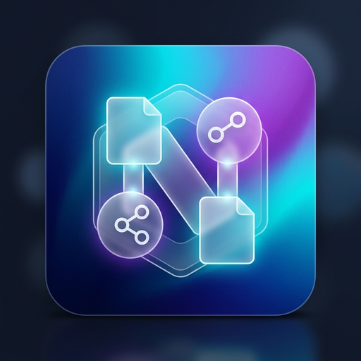

<div align="center">
  

  <h1>CN File Organizer</h1>

  <p><strong>Next-Generation Smart File Management for Linux</strong></p>

  <p>
    <a href="https://github.com/Marjuk06/CN-File-Organizer/releases"></a>
    <a href="https://www.rust-lang.org/"></a>
    <a href="https://tauri.app/"></a>
    <a href="https://github.com/Marjuk06/CN-File-Organizer/releases"></a>
    <a href="https://github.com/Marjuk06/CN-File-Organizer/releases"></a>
    <a href="LICENSE"></a>
  </p>
  
  <p>
    <em>Engineered for speed, built for safety. Take back control of your filesystem.</em>
  </p>
</div>

> [!WARNING]  
> **Under Active Development:** This software is currently under construction and may receive breaking changes or experimental features. Please ensure you always preview changes and rely on the undo mechanism during beta phases.

### Platform Support Matrix

| Platform | Status | Availability |
| :--- | :--- | :--- |
| **Linux** | Supported | AppImage, Debian/Ubuntu (`.deb`) |
| **Windows** | Under Construction | Active Development |
| **macOS** | Planned | Future Release |

---

**CN File Organizer** is an industry-grade, local-first file management utility designed exclusively for Linux. Built from the ground up in Rust, it delivers lightning-fast performance capable of parsing 100,000+ files in seconds. Whether you prefer an elegant Desktop GUI or a powerful CLI, every operation is completely transparent, dry-run by default, and 100% reversible.

---

## Key Features

- **Safe By Design:** Every action is previewed in a structured tree before execution. Nothing is moved without your explicit confirmation.
- **High Performance:** Rust-powered multi-threaded execution handles massive directories with near-zero latency.
- **Dual Interface:** A beautifully crafted Tauri Desktop GUI and a robust Command Line Interface (CLI).
- **Smart Categorization:** Automatically detects and organizes files by magic bytes (MIME types) into Documents, Images, Videos, Audio, Archives, Code, and more.
- **Advanced Duplicate Detection:** Multi-staged duplicate resolution (File Size -> Structural Fingerprint -> SHA-256 Hash) without moving or altering data.
- **Total Undo Capabilities:** Instantly reverse any operation using the integrated transaction journal.
- **Custom Rule Engine:** Write highly-specific, priority-based TOML rules to dictate exactly how files are managed.
- **Local-First Architecture:** Zero telemetry, zero cloud processing. Your filesystem stays on your machine.

---

## Installation

Choose the installation method that works best for your Linux distribution.

### Option 1: Automatic Installer (Recommended)
Run our one-line installer script to automatically download and configure the latest release:
```bash
curl -fsSL https://raw.githubusercontent.com/Marjuk06/CN-File-Organizer/main/packaging/install.sh | bash
```

### Option 2: Pre-compiled Binaries (GUI & CLI)
Head over to the [Releases](https://github.com/Marjuk06/CN-File-Organizer/releases) page and download the package for your distribution:

| Format | Recommended For | Instructions |
|---|---|---|
| **`.deb`** | Ubuntu, Debian, Zorin OS, Pop!_OS | `sudo dpkg -i CN.File.Organizer_1.0.0_amd64.deb` |
| **`AppImage`** | Arch, Fedora, openSUSE, Generic Linux | `chmod +x *.AppImage && ./CN.File.Organizer*.AppImage` |

---

## Quick Start Guide

### Using the GUI
1. Launch **CN File Organizer** from your application launcher.
2. Drag and drop the folder you wish to organize.
3. Select your preferred organizing algorithm (e.g., *Smart Organize, By Extension, Custom Rules*).
4. Review the generated before/after tree diagram.
5. Click **Confirm & Organize**. (Mistake? Go to the History tab and click Undo).

### Using the CLI
The `organize` binary is bundled with the application and offers advanced terminal capabilities:

```bash
# Launch interactive Guided Mode
organize

# Instantly Smart Organize a target directory
organize ~/Downloads

# Dry-run mode (Preview changes in terminal without modifying the filesystem)
organize --dry-run ~/Documents

# View all available flags and capabilities
organize --help
```

---

## Building From Source

For developers, contributors, or those who prefer compiling from source.

**Prerequisites:** 
- `rustc` 1.70+ and `cargo`
- `node.js` 18+ and `npm`
- Linux WebKit dependencies (e.g., `libwebkit2gtk-4.1-dev`, `build-essential`)

```bash
# Clone the repository
git clone https://github.com/Marjuk06/CN-File-Organizer.git
cd CN-File-Organizer

# Build and start the Tauri Desktop App locally
npm --prefix ui install
npm --prefix ui run build
cargo run --release -p cn-tauri

# Alternatively, compile the headless CLI
cargo build --release -p cn-cli
./target/release/organize --version
```

---

## Documentation

Dive deeper into CN File Organizer's capabilities:

- [CLI Reference Guide](docs/cli-reference.md)
- [Writing Custom Rules (TOML)](docs/rules.md)
- [Security & Privacy Policy](SECURITY.md)
- [Architecture & Development](docs/development.md)

---

## Support & Contribution

We welcome bug reports, feature requests, and pull requests. 
- **Found a bug?** Open an issue on our [Issue Tracker](https://github.com/Marjuk06/CN-File-Organizer/issues).
- **Want to contribute?** Read our [Contribution Guidelines](CONTRIBUTING.md).
- **Need help?** Reach out at **marjukamin06@gmail.com**.

---

<div align="center">
  <p>Built with precision by <a href="https://github.com/Marjuk06">Marjuk06</a> and Contributors.</p>
  <p>Licensed under the <a href="LICENSE">MIT License</a>.</p>
</div>
